# Grouple
GROUPLE USER MANUAL:
Note: To use Grouple you must have an internet connection and access to Google Play Services.

Step #1: Logging In or Creating an Account:

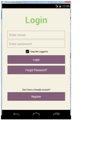
 
If you have an account, simply type your email address and password into the fields and then click the 'Login' button.  You can have Grouple remember your login information by checking the box that says 'Keep Me Logged In'. 
If you do not have a Grouple account yet, click the Register button near the bottom to create your new account.  Fill out required fields and then click the 'Register' button.  You will be returned to the login screen where you can proceed with login using your newly created account.

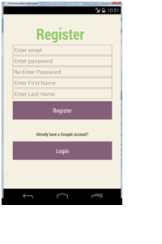 

Step #2: Exploring the Home Screen:
After logging in, you'll arrive at the Grouple home screen.  Here, you can view and access all major areas of the application including 'Profile', 'Messages', 'Settings', 'Friends', 'Groups', and 'Events'.

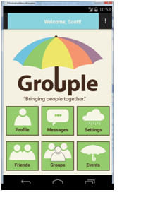

Step #3: Features of 'Profile':
By clicking on the 'Profile' button, you'll arrive at your user profile.  Here you can see information about 
your profile and make changes to your profile.  You'll have access to view your 'Past Events', 'Badges', 'Friends', 'Groups', 'Upcoming Events', and 'Edit Your Profile'.

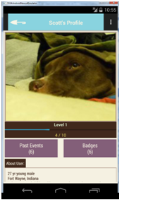
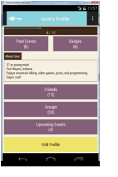
  
By clicking the 'Edit Profile' button, you'll be able to make changes to your profile information.  Set your profile picture, name, birth date, location, about, and gender and then hit the 'Submit' button to save.

Step #4: Features of 'Friends':
By clicking on the 'Friends' button, you'll arrive at the friends menu.  Here you can add a friend by clicking 'Add Friend', view your current friends by clicking 'My Friends', and view any friend requests you have waiting by clicking 'Friend Requests'.

Adding a Friend:
After clicking on 'Add Friend' from the Friends menu, simply type a user's email into the box and then press 'Add'.  If the email is another registered Grouple user, your friend request will be sent.

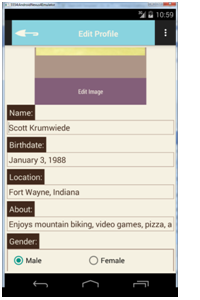

Responding to Friend Requests:
After clicking on 'Friend Requests' from the Friends menu, you'll be presented with a list of all users who have sent you a friend request.  To accept the friend request, simply press the green button next to their email.  To decline, press the orange button next to their email.

Step #5: Features of 'Groups':
By clicking on the Groups button, you'll arrive at the groups menu.  Here you can create a group by clicking 'Create Group', view your current groups by clicking 'My Groups', and view any group requests you have waiting by clicking 'Group Invites'.

Creating a Group:
After clicking the 'Create Group' button, fill out all information about the group you want to create.  Once you are ready, click 'Confirm Create Group' button to proceed.

Inviting Friends to Your Group:
Once you've created your Group, you can invite friends to it by clicking the 'Invite Friends to Your Group'
 button that appears in the dialog after creating.  Once at the 'Invite to group' list, simply check any friends you want to invite to your group.  When you are finished, click 'Confirm Invite Friends' button to send the invites.
 
 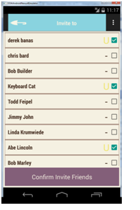

Step #6: Features of 'Events':
By clicking on the Events button, you'll arrive at the Events menu.  Here you can create an event by clicking 'Create Event, view your Upcoming events by clicking 'Upcoming Events', view your Pending events by clicking 'Pending Events', view your Past events by clicking 'Past Events', view your Declined events by clicking 'Declined Events' and view any event requests you have waiting by clicking 'Event Invites'.

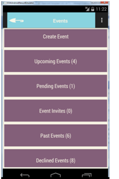

Creating an Event:
After clicking the 'Create Event' button, fill out all information about the event you want to create.  Events have a number of interesting fields that allow you to create your perfect Event:
•	Event Name: This is the name of your event.
•	Category:  This is the type of event you are creating.  Choose from 'Social', 'Entertainment', 'Professional', 'Fitness', or 'Nature'.
•	About Event:  This will tell users what your event will be about.
•	Start/End Date: This will determine when your event will happen.
•	Recurring Event:  You can use this option to make your event automatically recreate Weekly, Monthly, or Annually.
•	Location:  This is the specified location of your event.
•	Minimum size: This will determine how many people you need to make your event become Upcoming to ensure you have enough interest to make your event actually happen.
•	Maximum size: This will determine a maximum number of participants who can join your event to ensure too many people do not join.
•	Privacy Settings:  You can set your event to either Public or Private.  Public events can be joined by anyone, whereas private events require an invite from you or another participant with invite privileges.

Once you are ready, click 'Confirm Create Event' button to proceed.

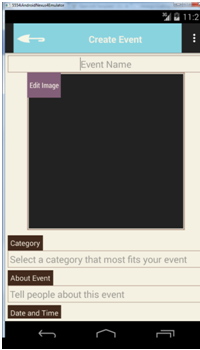
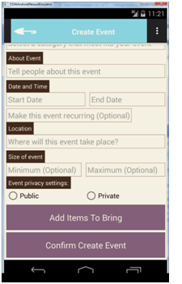
   
Inviting Groups to Your Event:
Once you've created your Event, you can invite groups to it by clicking the 'Invite Groups to Your Event'
 button that appears in the dialog after creating.  Once at the 'Invite to Event' list, simply check any Groups you want to invite to your Event.  When you are finished, click 'Confirm Invite Groups' button to send the invites.  Every user of those Groups will receive an invite to your event.

Step #7: Features of 'Messages':
By clicking on the Messages button, you'll arrive at the Messages list.  This will be a list of all recent conversations you've started with friends.  They will be sorted in most recently sent order.  In addition, messages that you haven't viewed before will be highlighted in yellow.  Click any row to view those messages or click the 'New Message' button at the bottom to start a new conversation with one of your friends.

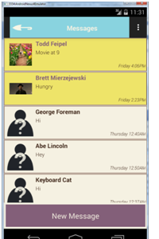
  
Step #8: Features of 'Settings':
By clicking on the Settings button, you'll arrive at your Settings list.  This will allow you to change account settings regarding email and android notifications.  In addition, you can perform other account actions such as changing your email address, account password, or deleting your account.

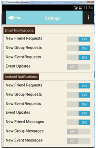
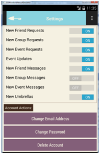

Note: If you delete your account, your account will be flagged for deletion but will be kept in our system for the next 30 days.  To restore your account, simply log back in with your account information during those 30 days and your account will be restored without loss!

Step #9: Using the Actionbar to Navigate or Logout
Please remember that at anytime, you can use the actionbar button at the top-right corner of the application to easily navigate within Grouple.  Simply click the button to quickly move to 'Home', 'Profile', 'Messages', 'Friends', 'Groups', 'Events', or 'Settings'.  This is also where you can Logout out of your account by hitting the 'Logout' option.

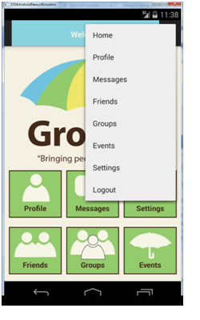
